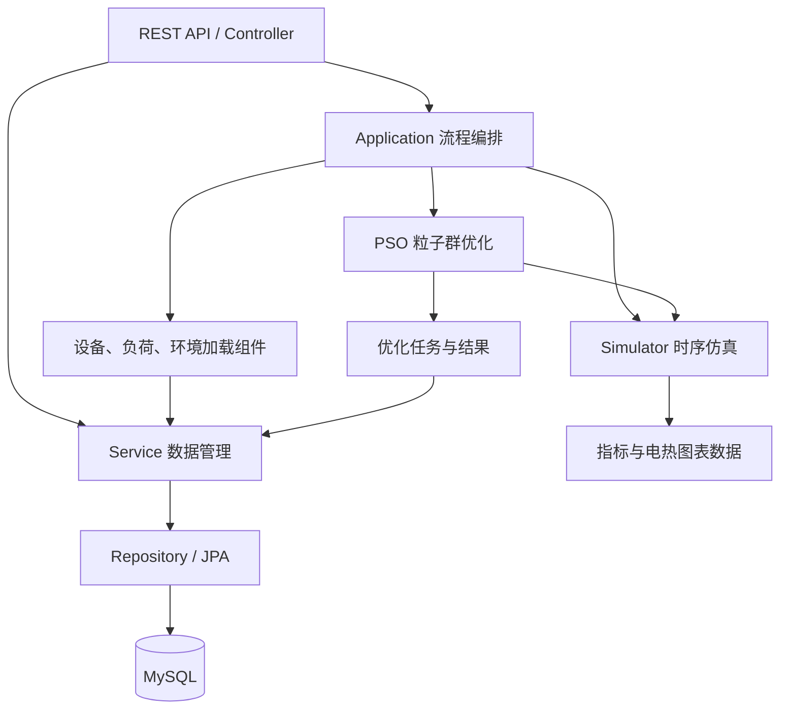

# eSimulate 架构分析备忘

- 分析日期：2026-09-28
- 源码基线：689db050f5c9f96c3d3cb2ca809731c4bbe02616
- 分析范围：后端结构、仿真与优化调用链、设备建模、持久化和任务管理。
- 验证方式：阅读源码与已有测试；未启动服务、未执行构建或测试。下面的架构判断与问题基于静态检查，不代表数值验收通过。

## 总体判断

eSimulate 是分层单体后端，内部集成时序仿真和粒子群优化引擎。技术栈为 Java 8、Spring Boot 2.7.12、Spring Data JPA、MySQL，使用一个 Maven 工程构建部署。当前仓库包含后端。

整体结构容易理解，普通仿真与优化复用同一套计算逻辑；但计算模型与数据库映射、图表输出之间的边界较薄。作为科研原型已有清楚骨架，作为长期发展的计算平台，需要优先加强计算契约、职责边界和任务可靠性。

## 模块及调用关系

| 模块 | 实际职责 |
| --- | --- |
| core/controller | 设备、环境、负荷、仿真和优化接口 |
| core/application | 加载计算输入、执行仿真、驱动优化任务 |
| core/service | 查询、增删改、事务和部分数据转换 |
| core/repository | Spring Data JPA 数据访问 |
| core/model | 数据库实体，同时承载设备计算行为和运行状态 |
| core/pso | 粒子运动、优化维度、仿真器及设备能力接口 |
| core/pojo、converter | 请求、响应、图表结构和持久化转换 |
| frame | 主要是用户管理与登录，尚非完整通用框架 |
| common、config | 响应封装、异常处理、安全和线程池配置 |

## 普通仿真链路

入口为 [SimulateController](../src/main/java/org/esimulate/core/controller/simulate/SimulateController.java)，由 [SimulateApplication](../src/main/java/org/esimulate/core/application/SimulateApplication.java) 编排：

1. 请求指定设备、负荷方案和环境方案的 ID，以及设备数量。
2. DeviceComponent、LoadDataComponent、EnvironmentDataComponent 通过 Service 从数据库加载对象。
3. [Simulator](../src/main/java/org/esimulate/core/pso/simulator/Simulator.java) 按时间索引依次计算。
4. 汇总成本、碳排放、可再生能源占比、弃能率和电热图表数据。

每个时刻的固定调度顺序为：生产能源 → 与负荷比较 → 储能调节 → 可控设备调节 → 外部供应补充。

当前核心更接近综合能源系统的时序供需平衡与规则调度。已追踪的计算链路没有电网节点、支路及潮流方程求解。

## 粒子群优化链路

入口为 [PSOController](../src/main/java/org/esimulate/core/controller/pso/PSOController.java)，由 [PsoApplication](../src/main/java/org/esimulate/core/application/PsoApplication.java) 驱动：

1. 创建数据库任务，异步执行，接口立即返回任务 ID。
2. 每个 [Particle](../src/main/java/org/esimulate/core/pso/particle/Particle.java) 对应一组整数设备数量，在上下界内移动。
3. 每个候选配置调用同一个 Simulator，以年度总成本作为适应度。
4. [SimulateSnapshot](../src/main/java/org/esimulate/core/pojo/pso/SimulateSnapshot.java) 判断可再生能源占比、弃能率约束；[OptimizeResult](../src/main/java/org/esimulate/core/pojo/pso/OptimizeResult.java) 在更新全局最优时过滤不满足约束的候选。
5. 客户端轮询状态、获取结果或请求取消。

这里优化的是设备配置数量，运行调度仍由仿真器的固定规则决定。任务配置和部分结果通过 JPA Converter 以 JSON/TEXT 字段保存到 [OptimizeTask](../src/main/java/org/esimulate/core/model/task/OptimizeTask.java)。

## 值得保留的设计

- 仿真引擎复用：普通仿真与优化候选评估调用同一套计算，避免维护两套业务规则。
- 设备按能力组织：Producer、Storage、Adjustable、Provider 分别表示生产、储能、调节和供应，仿真器主要按能力调用。
- 设备自身承担计算行为：风机出力、电池充放电等逻辑位于设备类中，Controller 相对简洁。
- 考虑粒子运行状态隔离：粒子初始化及每次评估会克隆设备；已检查的风机、电池实现会重建运行记录列表。此结论不等于所有设备克隆实现均已完整验证。
- 存在应用编排层：计算流程由 Application 组织，数据库操作通常通过 Service 的事务完成。

## 主要架构问题与证据

### 1. 设备类混合多种职责

[BatteryModel](../src/main/java/org/esimulate/core/model/device/BatteryModel.java) 同时包含数据库字段映射、设备参数、动态储能状态、充放电算法、优化上下界和图表生成。[WindPowerModel](../src/main/java/org/esimulate/core/model/device/WindPowerModel.java) 也存在类似结构。

[Device](../src/main/java/org/esimulate/core/pso/simulator/facade/Device.java) 带有 JPA 注解，[ElectricDevice](../src/main/java/org/esimulate/core/pso/simulator/facade/ElectricDevice.java) 的接口直接返回图表对象。因此，独立计算核心尚未形成；存储或图表变化会触及计算模型。

### 2. 调度策略固定，设备顺序影响结果

Simulator 中储能和可控设备依次处理剩余供需差额。先执行的设备会改变后续设备输入，列表顺序具有业务含义。当前没有独立的调度策略契约，支持不同优先级、经济调度或控制方案需要修改仿真器。

### 3. 时间轴、单位和时间步长契约不明确

Simulator 只检查输入序列长度一致，再按索引取值，没有验证时间戳逐项对齐。[ElectricLoadScheme](../src/main/java/org/esimulate/core/model/load/electric/ElectricLoadScheme.java) 直接按列表取值，而部分环境对象会先排序，图表横轴又单独排序。

同样长度的序列仍可能在不同时间点之间进行计算。已检查模型涉及 W、Wh、kW、kWh，计算入口没有显式时间步长参数，需要进一步验证功率到能量的换算假设及单位一致性。

### 4. 异步任务生命周期不完整

PsoApplication 和 [OptimizeTaskService](../src/main/java/org/esimulate/core/service/pso/OptimizeTaskService.java) 中可见：

- 检测取消后退出循环，末尾仍将任务设为 COMPLETED。
- 每轮先保存工作线程持有的任务，再读取取消状态，存在覆盖外部取消的竞争风险；具体竞争场景尚未运行验证。
- [TaskStateEnum](../src/main/java/org/esimulate/core/model/enums/TaskStateEnum.java) 没有 FAILED，异步主流程缺少异常后更新任务状态的处理。
- [AsyncConfig](../src/main/java/org/esimulate/config/AsyncConfig.java) 配置任务线程池，但内部还使用并行流，任务并发和计算并发缺少统一控制。

这些影响取消、失败反馈和多任务运行的可靠性。

### 5. 可复现性与端到端验证不足

任务保存请求配置，但设备、环境、负荷主要通过 ID 引用，未看到完整输入版本快照；数据后来修改后，仅凭任务配置不一定能复现原计算。粒子运动也没有显式随机种子。

已有部分设备行为及数据格式测试，但 [SimulatorTest](../src/test/java/org/core/pso/simulator/SimulatorTest.java) 只构造数据，没有调用仿真器；[MomentResultTest](../src/test/java/org/core/model/result/MomentResultTest.java) 没有断言。当前测试不能充分证明完整仿真与优化链路正确。此次未执行测试，不对测试通过率作结论。

### 6. 登录能力尚未形成有效访问控制

[SecurityConfig](../src/main/java/org/esimulate/config/SecurityConfig.java) 当前使用 anyRequest().permitAll() 放行全部接口。虽然实现了登录和 JWT 生成，访问控制尚未接入有效保护链路。

## 建议的演进顺序

1. 明确计算契约：时间轴对齐、单位、时间步长、供需缺口和失败语义；建立端到端数值回归用例。
2. 修正任务生命周期：取消、失败、并发状态更新和运行资源限制。
3. 分开设备参数、运行状态和计算结果：数据库实体转换为计算输入，计算结束后再转换成图表。
4. 提取调度策略和优化评价接口：PSO 负责搜索，仿真器负责评估，调度策略决定设备执行顺序。
5. 补齐输入快照、随机种子和访问控制。

建议按上述真实变化点逐步演进，保留当前仿真复用与设备能力接口，不必为了分层一次性引入大量接口或拆成微服务。
